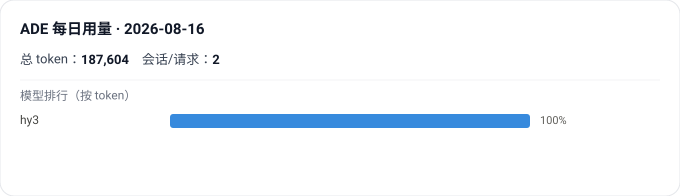

# ADE 每日用量

> 自动展示我每天在各 ADE（Cursor / OpenAI / DeepSeek / 中转站 / WorkBuddy）上使用的模型、对话数与 token 消耗。
> 由 GitHub Action 每日定时更新。

<!-- WIDGET_START -->

<!-- WIDGET_END -->

## 原理
采集（cloud 类走 API，local 类走本机脚本）→ 聚合为统一 schema → 渲染 SVG → 提交到本仓库。详见各 collector。

## 运行
- **云端（GitHub Action）**：`python run.py --mode cloud --date <YYYY-MM-DD>`，凭据放仓库 Secrets。
- **本机（Cursor / WorkBuddy 等本地源）**：`python run.py --mode local --date <YYYY-MM-DD>`，跑完把 `data/local/*.json` 推回仓库（git push 或 PAT 写文件）。
- 配置：复制 `config/sources.example.yaml` 为 `sources.yaml` 并填入你的源。

## React 组件（博客用）

本项目同时提供一个 **React 版本** 的用量组件，方便嵌进博客：复用同一份 `data/stats.json`，渲染逻辑用 React 重写，观感与上方 SVG 一致。

- 代码：`react/src/UsageWidget.tsx`（零额外依赖，纯 React + 内联样式）。
- 本地预览：`cd react && npm install && npm run dev`（Vite 直接读取仓库根的 `data/stats.json`）。
- 集成：组件接受 `dataUrl`（运行时从 CDN 拉取，随 GitHub Action 自动更新）或 `data`（构建时注入）两种模式，可放入 Next.js / Astro / Vite 等任意 React 环境。详见 `react/README.md`。

## WorkBuddy 接入（local 采集器）

WorkBuddy 用量通过读它自身运行库 `~/.workbuddy/workbuddy.db` 采集（无需 API key）：

- `session_usage.used` → 该会话累计消耗（token / 积分；`size` 字段恒为 192000，疑似配额上限）
- `sessions.model` → 模型名（如 `hy3`）
- `sessions.created_at` → 归到该会话的创建日

限制（当前 db 只落盘到这种粒度）：

- 只有每会话累计 `used`，**无 input / output 拆分**，故整体计入 `input_tokens`（`total_tokens = used`）。
- 无 requests 计数，按每会话计 `requests = 1`。
- 全账号共享（所有项目的 session 都在这张库里），不限于当前项目。
- 走 named pipe 通信，不监听 TCP，故 8080 本地 API / quota 日志目录在当前版本均不可用。

回流：本采集器是 local 模式，需本机跑 `python run.py --mode local --date <YYYY-MM-DD>`，产物 `data/local/workbuddy.json` 已将该目录从 `.gitignore` 放行，需 `git add` 并提交回仓库，GitHub Action 才读得到。

> 早期版本 `config/sources.example.yaml` 把 type 写成 `workbuddy_local`，与 `run.py` 的 `LOCAL_SIDE` 键不匹配会静默跳过；现已改为 `workbuddy`（Cursor 同理 `cursor_local` → `cursor`）。

